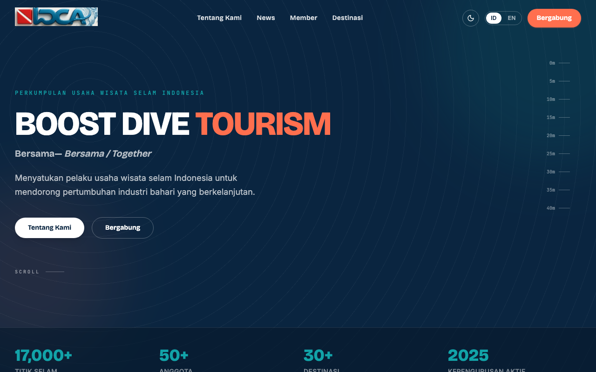

# IDCA — Indonesia Dive-tourism Company Association

Official marketing website for **IDCA** (*Perkumpulan Usaha Wisata Selam Indonesia* / PUWSI).

**Live site:** [diveassociation.id](https://diveassociation.id)

---

## About IDCA

**Indonesia Dive-tourism Company Association (IDCA)** is the national association for dive-tourism businesses in Indonesia. Based in Jakarta, IDCA unites dive operators, marine resorts, dive centers, and industry stakeholders to:

- Set and promote professional industry standards
- Advocate for sustainable marine tourism policy
- Represent Indonesian dive tourism at international expos and forums
- Connect members across 34 provinces through a shared industry network

IDCA's mission is to strengthen Indonesia's dive tourism ecosystem through collaboration, human resource development, and protection of the country's marine environment — positioning Indonesia as a world-class, sustainable dive destination.

**Contact**
- Website: [diveassociation.id](https://diveassociation.id)
- Instagram: [@diveassociation.id](https://www.instagram.com/diveassociation.id/)
- WhatsApp: [+62 812 1234 3407](https://wa.me/6281212343407)

---

## Website snapshot

Homepage preview (hero, bilingual navigation, news, members, and destinations):



**Key features**
- Bilingual UI (Indonesian / English) with persistent language toggle
- Light and dark mode
- Content managed via **Astro Content Collections** (MDX) for News, Members, and Destinations
- Member registration form (WhatsApp handoff)
- Responsive layout with IDCA brand design tokens (ocean navy, reef teal, coral accent)

---

## Stack

| Layer | Technology |
|---|---|
| Framework | [Astro 7](https://astro.build) (static output) |
| UI islands | React 19 (`LangToggle`, `ThemeToggle`, `MobileNav`, `RegisterForm`) |
| Styling | Tailwind CSS v4 + custom design tokens in `src/styles/global.css` |
| Components | shadcn/ui primitives under `src/components/ui/` |
| Content | Astro Content Collections + MDX (`@astrojs/mdx`) |
| Deployment target | [diveassociation.id](https://diveassociation.id) |

---

## Getting started

```sh
npm install
npm run dev        # http://localhost:4321
npm run build      # outputs to ./dist
npm run preview    # preview the production build
```

Requires **Node.js ≥ 22.12**.

---

## Project structure

```
src/
├── content/              # MDX content (News, Members, Destinations)
│   ├── news/
│   ├── members/
│   └── destinations/
├── content.config.ts     # Collection schemas (Zod)
├── components/
│   ├── site/             # Page sections + React islands
│   └── ui/               # shadcn/ui primitives
├── layouts/
│   └── Layout.astro
├── pages/
│   └── index.astro
└── styles/
    └── global.css        # Design tokens, bilingual + theme CSS
public/
├── logo/                 # IDCA logo assets
├── news/                 # News images
├── team/                 # Team photos
└── readme-screenshot.png # README preview image
```

---

## Content collections

News, members, and destinations are authored as **MDX files** under `src/content/`. Each file has typed frontmatter (validated by Zod in `src/content.config.ts`) and an MDX body for bilingual copy.

**Example — add a news article** (`src/content/news/my-article.mdx`):

```mdx
---
title:
  id: "Judul Berita"
  en: "News Title"
category:
  id: "Expo"
  en: "Expo"
image: "/news/my-photo.png"
year: "2026"
tag:
  id: "Event Tag"
  en: "Event Tag"
featured: false
order: 8
---

<span lang="id">Ringkasan dalam Bahasa Indonesia.</span>

<span lang="en">Summary in English.</span>
```

Set `featured: true` on one news item to highlight it as the main article. Use `order` to control display order.

---

## Design tokens

| Token | Hex | Use |
|---|---|---|
| `abyss` | `#0a2540` | Deep navy — hero, footer, dark sections |
| `reef` | `#0d7377` | Primary teal — links, accents |
| `coral` | `#ff6f4e` | Warm accent — CTAs, highlights |
| `sand` | `#f5f0e6` | Light background |
| `ink` | `#10202e` | Body text on light backgrounds |

Fonts: **Bricolage Grotesque** (headlines) · **Inter** (body) · **JetBrains Mono** (labels)

---

## License

© IDCA — Indonesia Dive-tourism Company Association. All rights reserved.
